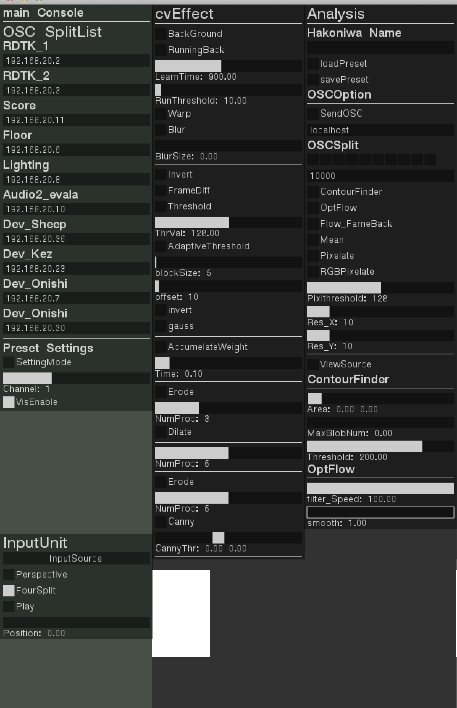

#dpCameraUnit

カメラユニットはDividualPlaysのための映像解析ツールです。

##outline
マスター箱庭からのOSCを受けて、RAMDanceToolKitへシーンの切り替えを行います。
切り替わりのタイミングで、マトリクススイッチャー(IMAGENICS SW1010)の入出力をシリアル通信でスイッチング、指定された箱庭からの映像解析を開始します。

同時に、オーディオPC、照明用PCへ現在のシーン状態の情報を送ります。

##Main console
OSCの送信先を決定します。

##Input Unit
映像ソースを切り替えます。本番環境(ADVC-55)が接続されている場合は自動的に切り替わります。
**FourSplit:** 本番用・1本の映像ソースを4分割して処理します。

##CvEffect
映像ソースにエフェクトを加えます。複数のエフェクトを同時に適用でき、エフェクトは上にある項目から順番に処理されていきます。

**Background**：背景差分を行います。有効にした瞬間のピクセルを背景として使用します。

**Warp**：逆パース変換をかけます。UI下部のサムネイルに黄色い枠が表示されるので、その枠をドラッグして変形します。

**Blur**：ブラーをかけます。

**Invert**：ピクセル色を反転します。

**FrameDiff**：フレーム間差分を行います。前フレームとのAbsDiffを結果として使います。

**Threshold**：閾値処理を行います。

**AdaptiveThreshold**：適応的な閾値処理を行います。

**AccumelateWeight**：前フレームを一部残した状態で返します。

**Erode**：明るいエリアを縮小します。

**Dilate**：明るいエリアを膨張します。

**Canny**：輪郭を抽出します。

##Analysis
CvEffectsで最適化された映像を解析し、所定のコンピュータへOSCとしてデータを送信します。

**Hakoniwa Name**：箱庭の名前。OSCのアドレス・プリセットの保存名称として使用されます。
**Load Preset**：入力したHakoniwa nameのプリセットを読み込みます。
**Save Preset**：変更したcvEffect・AnalysisのUIデータをプリセットとして保存します。
**Send OSC**：OSCを送信を有効化します。
**OSCSplit**：OSCの送信先を選択します。横並びのトグルは、画面左側のOSC SplitListに対応しています。

##解析法とOSCフォーマット
####ContourFinder
***/dp/cameraUnit/hakoniwaName/contour/boundingRect***

**[Int] numRects, [Int]Label, [Float]rects-X, [Float]rects-Y, [Float]rects-W, [Float]rects-H**

Arg総数 --- 5 * n + 1

概要：Blobを囲う矩形

***/dp/cameraUnit/hakoniwaName/contour/blob***

**[Int] numBlob, [Int]numPts, [Float]pt-X, [Float]pt-Y, .....**

概要：輪郭の頂点座標

***/dp/cameraUnit/hakoniwaName/contour/area***

**[Int] numAreas, [float]area1, [float]area2 ,,,**

概要：輪郭の面積

---
####mean
***/dp/cameraUnit/hakoniwaName/mean***

**[Int] mean_R, [Int]mean_G, [Int]mean_B, [Int]mean_Brightness**

概要：画面全体のピクセルトータル数(≒明るさ)

---
####optFlow(pyrLK)

***/dp/cameraUnit/hakoniwaName/features***

**[Int] numPt, [Float]X, [Float]Y,[Float]vec_X,[Float]vec_Y,,,,**

***/dp/cameraUnit/hakoniwaName/vector***

**[Float] vec_X, [Float]vec_Y ,,,**

Arg総数 --- 2 * 10

概要：動きの平均値を10個のベクターに集約したデータ

***/dp/cameraUnit/hakoniwaName/vector/length***

**[Float] Length1 ,,, [Float] Length10**

Arg総数 --- 10

概要：動きの長さ平均を10個のベクターに集約したデータ

***/dp/cameraUnit/hakoniwaName/vector/total***

**[Float] VecX, [Float] VecY**

Arg総数 --- 2

概要：動きの平均を1個のベクターに集約したデータ

---
####Pixelate
***/dp/cameraUnit/hakoniwaName/pixelate***

***/dp/cameraUnit/hakoniwaName/pixelate/r***

***/dp/cameraUnit/hakoniwaName/pixelate/g***

***/dp/cameraUnit/hakoniwaName/pixelate/b***

**[Int32]width, [Int32]height, [Int64]pixelBit,,,,,**

Arg総数 --- 2 + width * height / 64

概要：画像をピクセレートしたデータ

Sample:

	vector<bool> pixels;

	pix_w = m.getArgAsInt32(0);
	pix_h = m.getArgAsInt32(1);

	pixels.clear();
	pixels.assign(m.getArgAsInt32(0) * m.getArgAsInt32(1), false);

	for (int64_t i = 0;i < pixels.size();i++){
		int64_t bt = m.getArgAsInt64(2 + i / 64);
		int64_t targetBit = int64_t(1) << (i % 64);
		pixels[i] = (bt & targetBit) > 0;
	}
